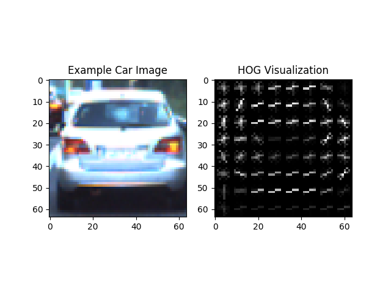
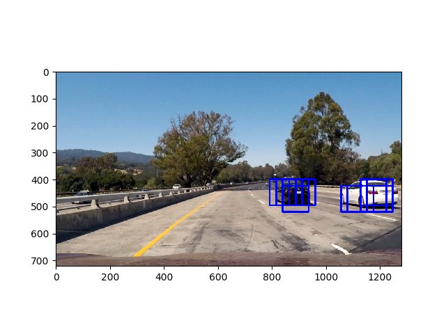
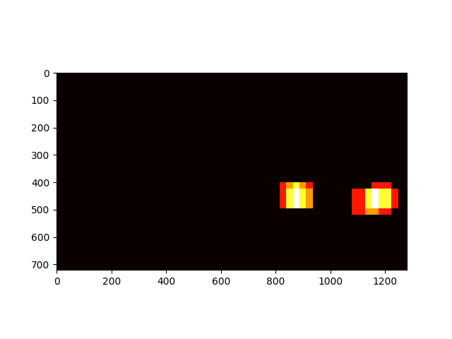
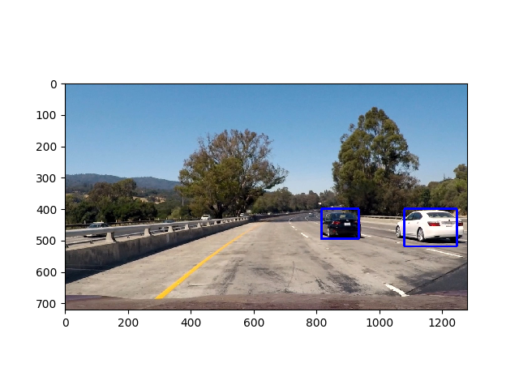

**Vehicle Detection Project**

The goals / steps of this project are the following:

* Perform a Histogram of Oriented Gradients (HOG) feature extraction on a labeled training set of images and train a classifier Linear SVM classifier
* Optionally, you can also apply a color transform and append binned color features, as well as histograms of color, to your HOG feature vector. 
* Note: for those first two steps don't forget to normalize your features and randomize a selection for training and testing.
* Implement a sliding-window technique and use your trained classifier to search for vehicles in images.
* Run your pipeline on a video stream (start with the test_video.mp4 and later implement on full project_video.mp4) and create a heat map of recurring detections frame by frame to reject outliers and follow detected vehicles.
* Estimate a bounding box for vehicles detected.

### Files

[README(This File)](./README.md)

[Hog Features](./output_images/test1_hog_features.png)

[Hog Sub Sampling](./output_images/test1_hog_subsampling.png)

[Heat Map](./output_images/test1_hot.png)

[Pruned Image](./output_images/test1_pruned_windows_final.png)

[Video](./project_video_output.mp4)

[Camera Calibration Data](./camera.pkl)

### Histogram of Oriented Gradients (HOG)

get_hog_features() : L14 in common_functions.py

* Used example code from tutorial as such
* Experimented with HSV and YCbCr color spaces. I got better results with YCbCr

Initial experiments showed that models trained with ALL hog channels performed better. I didn't tweak any of the other parameters.
ystart and ystop were picked to focus on the bottom half of the image.

Hyper parameters used:

orient 9

pix_per_cell 8

cell_per_block 2

hist_bins 32

spatial_size (32, 32)

ystart = 400

ystop = 720

scale = 1.5

hog_channel = ALL

Color space: YCbCr

Here is what an HOG example looks like for a car image.

### Training the Classifier

See train_model() L67 in search_classify_v2.py

Key steps:
i. Load all the car and non-car examples using load_data()
ii. Generate hog, spatial and color histogram features
iii. Normalize features
iv. Randomize the train-test split
v. Use Linear SVM to build a model
vi. Save model to pickle

For optimizing performance of classifier:

i. I used full data set from udacity
load_data() at L35 of search_classify.py shows how this is done using glob module. 

ii. I used HOG + Color Historgrams + Spatial features.

These yielded best performance on the test set. Accuracy of 0.99

### Hog Sub sampling

Initially I played around with the basic sliding window approach (slide_window() in common_functions.py) 
using multiple window sizes (96,96) and (64,64) with an xy-overlap of 0.5 and 0.75(worked better)
However, it was too slow. Each frame took around 10 seconds to process 
and that meant it took around 50 minutes to run through the project_video which was about 50 seconds long.

I ended up picking the hog subsampling method provided in the tutorial. 
It ended up being much more efficient and took about 2 seconds per frame. 

find_cars() in L318 contains the code borrowed from the tutorial with a tweak to return the boxes instead of drawing them.

Hyperparameters for hog-subsampling with color histogram  and spatial features:

+ scale=1.5(default)
+ cells_per_step = 2(default) (overlap parameteris not applicable)

Here's an example result showing the heatmap from a test image.

### Video Implementation

Key Steps:

For each frame of the video:

i. Use Hog sub sampling + color+ spatial features to detect cars. 
Please see common_functions.find_cars()

ii. Use lane detection techniques from past projects to detect lanes. 

Please see lane_functions.find_lane()
lane_functions also has calibrate_camera_and_perspective() which is used to figure out the distortion and correct 
warping transformation.

iii. Combine outputs of steps i and ii.

Here's a [link](./project_video_output.mp4) to my video result.

### Pruning of False positives
I used the approach described in the tutorial to build a heat map.

Please refer prune_false_positives() in L153 of [common_functions.py](./common_functions.py)

Here's an example result showing the heatmap from a test image.

Here's the result after applying pruning:

---

### Discussion/Challenges

+ Cars which are at an angle to the front facing camera can be a problem. 
As an example, at an intersection, car positions will wary from being adjacent to perpendicular to the front camera.
Without proper examples, the algorithm may struggle to detect such cars. 

+ Video processing is still too slow. 
Hog sub sampling helped speed up by a factor of 3-5X.

+ Jitter between frames
Smoothing and averaging car positions between frames can help.

+ Not detecting cars that are far away. 
This is because I've hard-coded the ystart and ystop to search from 400-720 range.
Increasing this will come at the cost of speed, so I did not do that.
Perhaps the averaging of past frames can give us a good indication of where a car will be in the next frame; 
We can use that estimate to narrow down the search instead of searching the entire image.
